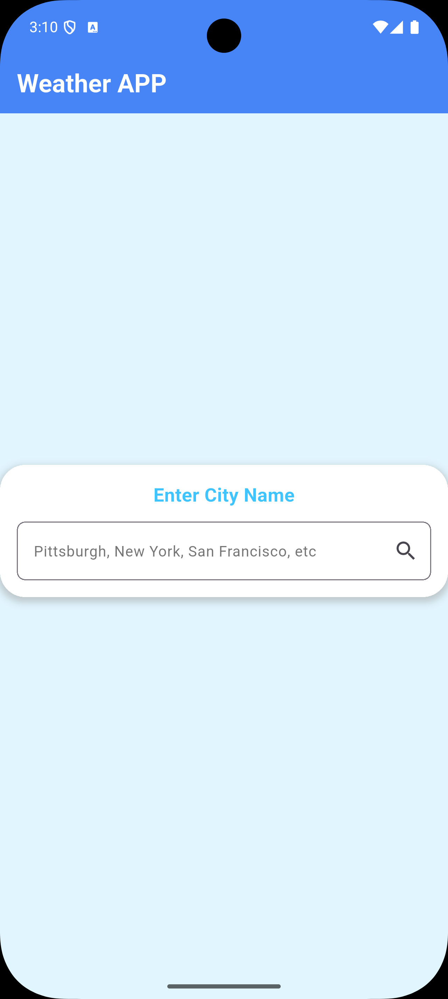
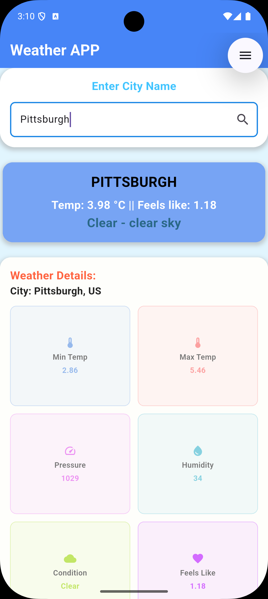
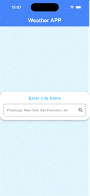

# Weather Flutter App 🌦️

A sleek, modern Flutter application that provides real-time weather insights using a robust service-provider architecture. Built with scalability and clean code principles in mind.

---

## 📖 Project Summary

The Weather Flutter App is a specialized tool designed to fetch, parse, and display live meteorological data. It follows a strict separation of concerns, ensuring that networking logic never leaks into the UI layer.


||||
|-|-|-|


### Architecture (MVVM-inspired)
* **Models**: Immutable data structures representing API responses.
* **Services**: The engine room for HTTP requests and JSON serialization.
* **Provider**: The state manager that exposes data to the UI via `ChangeNotifier`.
* **Screens**: Declarative views that react to state changes.


---

## 🛠️ Prerequisites

To run or contribute to this project, you will need:
* **Flutter SDK**: ^3.0.0.
* **Dart SDK**: Included with Flutter.
* **API Key**: A valid OpenWeatherMap (or equivalent) API key configured in `services/weather_service.dart`.
* **IDE**: VS Code or Android Studio with Flutter/Dart extensions.

---

## 📥 Installation

Follow these steps to set up the project locally:

1.  **Clone the Repository**
    ```bash
    git clone [https://github.com/your-username/weather-flutter-app.git](https://github.com/your-username/weather-flutter-app.git)
    cd weather-flutter-app
    ```

2.  **Install Dependencies**
    ```bash
    flutter pub get
    ```

3.  **Run the App**
    ```bash
    flutter run
    ```

---

## 📂 Folder Structure (`lib/`)

The `lib` directory is organized to facilitate easy navigation and testing:

| Directory | Description |
| :--- | :--- |
| **`models/`** | Contains `MainWeatherData`, `WeatherModel`, and condition enums. |
| **`provider/`** | Houses the `WeatherProvider` which manages loading/error/success states. |
| **`screens/`** | UI layouts like `WeatherScreen` for rendering data to the user. |
| **`services/`** | Low-level logic for networking (`weather_service.dart`) and state definitions. |


---

## 🔄 Data Flow

1.  **Request**: The `WeatherScreen` asks the `WeatherProvider` for data.
2.  **Fetch**: The `Provider` sets a loading flag and calls the `WeatherService`.
3.  **Process**: The `Service` fetches JSON and converts it into `Models`.
4.  **Update**: The `Provider` stores the model and notifies all listeners (UI).
5.  **Render**: The UI rebuilds to show the current temperature and conditions.

---

## 🧪 Testing & Contributions

* **Unit Tests**: Located in the `test/` folder. Use them to verify `WeatherService` parsing logic.
* **Widget Tests**: Verify that `WeatherScreen` correctly displays loading spinners and error messages.
* **Extension Points**: Easily add new features like wind speed or hourly forecasts by updating the `models/` and `weather_service.dart`.

---

## 📝 Coding Conventions

* Keep network logic inside `services`; never call HTTP directly from the UI.
* Models should be immutable with `fromJson` factory constructors.
* Providers should supply the minimal state needed to render the view.